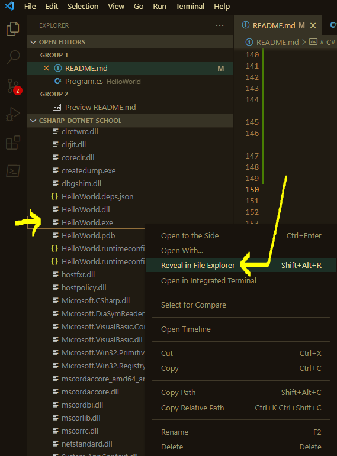
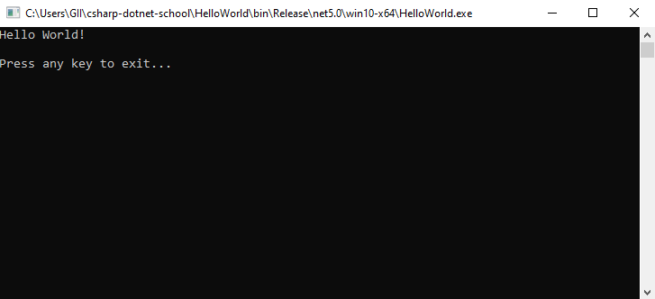

# C# .NET School

## What is This?

The purpose of this repo is to teach some fundamentals of C#

## What is Taught?

- How to build a C# app (collection of .cs and .csproj files) into a .exe runnable file
- How to debug C# code using a `vscode` IDE
- Provide simple examples of how to unit test C# code

## How to use this repo?

Read this readme file. 

Make sure you understand each section. 

It helps to read each section in sequence since each new section will build upon the knowledge described in previous sections.

## How was this Demo was created?

This demo follows the instructions from the Microsoft Website: <https://docs.microsoft.com/en-us/dotnet/core/tutorials/with-visual-studio-code?pivots=dotnet-5-0>

### Install the C# Extension for VSCode:

The [`vscode` extension](https://marketplace.visualstudio.com/items?itemName=ms-dotnettools.csharp) can be installed through the `vscode` IDE:

- C# for Visual Studio Code (powered by OmniSharp).


**Making sure .NET is Installed**

Do you have .NET installed on your computer?

Find out by opening the `vscode` terminal and checking if you can run the `dotnet` command in this Command Line Interface (CLI):

```
> dotnet --version
```

If you see that you have a version of dotnet, then you don't have to install it.

Example
```
5.0.400
```

Otherwise, download and install .NET. <https://dotnet.microsoft.com/en-us/download>

Once installed, check to see if you have the `dotnet --version` command available after restarting `vscode`.

**Creating the sample project**

Create a new folder inside your repo. This folder name will be the name of the project. For this example, we'll use `HelloWorld` as the project name:

```
> mkdir HelloWorld
> cd HelloWorld
```

Inside the `HelloWorld` run the following command to generate the starting C# .NET project:

```
> dotnet new console --framework net5.0
```

The command above would have generated the basic starting files for your starting project:


**Run the HelloWorld project**

You can run your CSharp project from the `HelloWorld` directory (the directory where the `.csproj` file is located):

```
> dotnet run
```

The `HelloWorld` project should output the following when it is run:

```
Hello World!
```

**Setup Build and Debug C# Assets**

If you are using the `C# Extension` (described previously) for the first time, then you will have to allow `vscode` to install some related dependencies. Luckily, you only have to do this once as an initial local setup.

To do this, just open a `.cs` file. For example, open this file:

```
<repoRoot>/HelloWorld/Program.cs
```

Wait a little bit, and if `vscode` prompts you to, then add the missing assets:


## How do you create the .exe file?

If you have a `.csproj` already, you may need to build it into a .exe file after you made changes to its source code. 

**Goal**

We will use the `HelloWorld` project as an example. The `HelloWorld` project simply prints the words "Hello World!" in a console terminal. So, if we successfully create a .exe file, then running this .exe file should simply open a console and print the words, "Hello World!".

**Create the .exe**

An important thing to note is you may have to specify the correct target "runtime" for your .exe file. This example, used `win10-x64`. But you may have to select a different runtime, depending on which runtime your .exe file needs to run. 

Here is one reference for different runtimes (also called "RIDs"): <https://docs.microsoft.com/en-us/dotnet/core/rid-catalog#windows-rids>

For a more extensive list of runtimes, you can refer to: <https://github.com/dotnet/runtime/blob/main/src/libraries/Microsoft.NETCore.Platforms/src/runtime.json>

You can [check the runtime of an environment](https://docs.microsoft.com/en-us/dotnet/core/install/how-to-detect-installed-versions?pivots=os-windows) with the following terminal command:

```
> dotnet --list-runtimes
```

To generate a `EXE` published file from your project, run this command in the same directory where your `.csproj` is located (use the appropriate runtime; this example uses `win10-x64`):

```shell
> dotnet publish -c Release -r win10-x64
```

```shell
# example output
Microsoft (R) Build Engine version 16.11.0+0538acc04 for .NET
Copyright (C) Microsoft Corporation. All rights reserved.    

  Determining projects to restore...
  Restored C:\Users\<MyUser>\csharp-dotnet-school\HelloWorld\HelloWorld.csproj (in 97 ms).
  HelloWorld -> C:\Users\<MyUser>\csharp-dotnet-school\HelloWorld\bin\Release\net5.0\win10-x64\HelloWorld.dll
  HelloWorld -> C:\Users\<MyUser>\csharp-dotnet-school\HelloWorld\bin\Release\net5.0\win10-x64\publish\
```

As you can see from the example output above, a `publish` path is output.

Open this `publish` folder and you will  find an `EXE` file.

For this project, the `EXE` file is `HelloWorld.exe` but the name of this `EXE` will match whatever name your project is using.



You can confirm the `EXE` file works, in this example, by double clicking it and seeing that it is successfully running the console application:



**A Note about Portability**

Please note, that your `EXE` file may require all of the generated files that were created around it to remain along-side the `EXE` in the same relative path. 

So, the `EXE` is NOT completely portable on its own. Intead, the entire `publish` folder must be kept all-together, it seems.

## Unit Tests

(TBD documentation about unit testing - TODO)

<https://docs.microsoft.com/en-us/dotnet/core/tutorials/testing-library-with-visual-studio-code?pivots=dotnet-5-0>