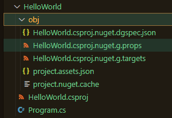
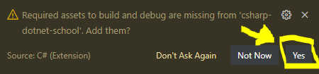

# C# .NET School

## What is This?

The purpose of this repo is to teach some fundamentals of C#

## What is Taught?

- How to build a C# app (collection of .cs and .csproj files) into a .exe runnable file
- How to debug C# code using a `vscode` IDE
- Provide simple examples of how to unit test C# code

## How to use this repo?

Read this readme file. 

Make sure you understand each section. 

It helps to read each section in sequence since each new section will build upon the knowledge described in previous sections.

## How was this Demo was created?

This demo follows the instructions from the Microsoft Website: <https://docs.microsoft.com/en-us/dotnet/core/tutorials/with-visual-studio-code?pivots=dotnet-5-0>

### Install the C# Extension for VSCode:

The [`vscode` extension](https://marketplace.visualstudio.com/items?itemName=ms-dotnettools.csharp) can be installed through the `vscode` IDE:

- C# for Visual Studio Code (powered by OmniSharp).


**Making sure .NET is Installed**

Do you have .NET installed on your computer?

Find out by opening the `vscode` terminal and checking if you can run the `dotnet` command in this Command Line Interface (CLI):

```
> dotnet --version
```

If you see that you have a version of dotnet, then you don't have to install it.

Example
```
5.0.400
```

Otherwise, download and install .NET. <https://dotnet.microsoft.com/en-us/download>

Once installed, check to see if you have the `dotnet --version` command available after restarting `vscode`.

**Creating the sample project**

Create a new folder inside your repo. This folder name will be the name of the project. For this example, we'll use `HelloWorld` as the project name:

```
> mkdir HelloWorld
> cd HelloWorld
```

Inside the `HelloWorld` run the following command to generate the starting C# .NET project:

```
> dotnet new console --framework net5.0
```

The command above would have generated the basic starting files for your starting project:



**Run the HelloWorld project**

You can run your CSharp project from the `HelloWorld` directory (the directory where the `.csproj` file is located):

```
> dotnet run
```

The `HelloWorld` project should output the following when it is run:

```
Hello World!
```

**Setup Build and Debug C# Assets**

If you are using the `C# Extension` (described previously) for the first time, then you will have to allow `vscode` to install some related dependencies for the first time.

To do this, just open a `.cs` file. For example, open this file:

```
<repoRoot>/HelloWorld/Program.cs
```

Wait a little bit, and if `vscode` prompts you to, then add the missing assets:



## How do you create the .exe file?

If you have a `.csproj` already, you may need to build it into a .exe file after you made changes to its source code. 

**Goal**

We will use the `HelloWorld` project as an example. The `HelloWorld` project simply prints the words "Hello World!" in a console terminal. So, if we successfully create a .exe file, then running this .exe file should simply open a console and print the words, "Hello World!".

**Create the .exe**

...

## How to debug using vscode

(TODO)

## Unit Tests

(TODO)