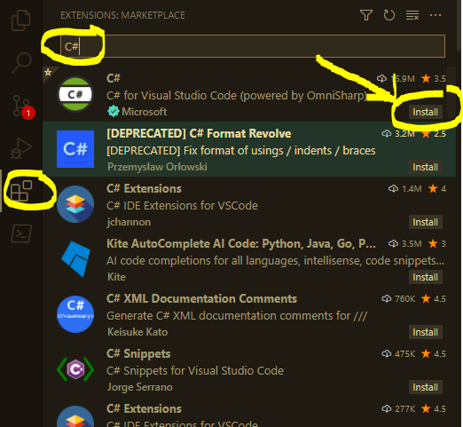

# C# .NET School

## What is This?

The purpose of this repo is to teach some fundamentals of C#

## What is Taught?

- How to build a C# app (collection of .cs and .csproj files) into a .exe runnable file
- How to debug C# code using a `vscode` IDE
- Provide simple examples of how to unit test C# code

## How this Demo was created

This demo follows the instructions from the Microsoft Website: <https://docs.microsoft.com/en-us/dotnet/core/tutorials/with-visual-studio-code?pivots=dotnet-5-0>

### Install the C# Extension for VSCode:

The [`vscode` extension](https://marketplace.visualstudio.com/items?itemName=ms-dotnettools.csharp) can be installed through the `vscode` IDE:



**Making sure .NET is Installed**

Do you have .NET installed on your computer?

Find out by opening the `vscode` terminal and checking if you can run the `dotnet` command in this Command Line Interface (CLI):

```
> dotnet --version
```

If you see that you have a version of dotnet, then you don't have to install it.

Example
```
5.0.400
```

Otherwise, download and install .NET. <https://dotnet.microsoft.com/en-us/download>

Once installed, check to see if you have the `dotnet --version` command available after restarting `vscode`.

**Creating the sample project**

...

## How to build the .exe file

(TODO)

## How to debug using vscode

(TODO)

## Unit Tests

(TODO)